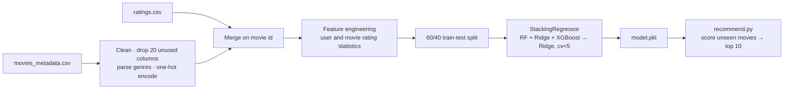

<div align="center">

# 🎬 Stacked Movie Recommender System

### Predict a user's rating for every unseen movie with a stacked ensemble, then recommend the top 10


</div>

---

## 📖 Table of Contents

1. [Overview](#-overview)
2. [Dataset](#-dataset)
3. [Pipeline](#-pipeline)
4. [Feature Engineering](#-feature-engineering)
5. [Model](#-model)
6. [Results](#-results)
7. [Generating Recommendations](#-generating-recommendations)
8. [Installation & Usage](#-installation--usage)
9. [Repository Structure](#-repository-structure)
10. [Known Limitations](#-known-limitations)
11. [Future Work](#-future-work)

---

## 🔭 Overview

This project frames movie recommendation as a **regression problem**: given a user and a movie, predict the rating the user would give. For a chosen user it scores every movie they have not rated and returns the 10 with the highest predicted rating.

- 🧹 **Large-scale preprocessing:** merges movie metadata with the full user-ratings table.
- 🧬 **Engineered features:** one-hot genres plus per-user and per-movie rating statistics.
- 🏗️ **Stacked ensemble:** Random Forest + Ridge + GPU-accelerated XGBoost, combined by a Ridge meta-model with 5-fold cross-validated stacking.
- 🎯 **End-to-end inference:** `recommend.py` loads the saved model and prints the top 10 titles for any user ID.

---

## 📚 Dataset

[The Movies Dataset](https://www.kaggle.com/datasets/rounakbanik/the-movies-dataset) by Rounak Banik on Kaggle.

| File | Used for |
|------|----------|
| `movies_metadata.csv` | Movie ID, title, genres, average vote |
| `ratings.csv` | `userId`, `movieId`, `rating` (the target) |

The full `ratings.csv` is large (the saved feature table alone is about **2 GB** and the trained model about **7 GB**), which is why the repo ships download links for the pretrained artifacts instead of the files themselves.

---

## 🔄 Pipeline



**Preprocessing steps (`train.py`)**

1. Drop unused metadata columns (budget, revenue, overview, popularity, poster path and others), duplicates and rows with missing values.
2. Cast `id` to `int32` and `vote_average` to `float32`; parse the genre strings into lists of genre names.
3. Save a `{movie_id: title}` dictionary (`title.pkl`) for readable output.
4. One-hot encode genres with `MultiLabelBinarizer` (20 genre columns).
5. Inner-join movies and ratings on movie ID.
6. Compute the engineered rating features (below) and cache everything to `cleaned_data.pkl`.

---

## 🧬 Feature Engineering

The model sees **26 features** per (user, movie) pair.

| Group | Features | Count |
|-------|----------|------:|
| Genres (one-hot) | Action, Adventure, Animation, Comedy, Crime, Documentary, Drama, Family, Fantasy, Foreign, History, Horror, Music, Mystery, Romance, Science Fiction, TV Movie, Thriller, War, Western | 20 |
| Movie metadata | `vote_average` | 1 |
| Movie statistics | `avg_rating_to_movie`, `total_rating_to_movie` | 2 |
| User statistics | `avg_rating_by_user`, `total_rating_by_user` | 2 |
| Interaction | `rating_deviation` (movie mean minus user mean) | 1 |

These statistics let the model separate "this user rates harshly" from "this movie is generally liked", and the counts give it a notion of how reliable each average is.

---

## 🧠 Model

A **`StackingRegressor`** with three diverse base learners and a linear meta-model:

| Role | Model | Key settings |
|------|-------|--------------|
| Base learner | Random Forest | 80 trees, max depth 25 |
| Base learner | Ridge Regression | default regularisation |
| Base learner | XGBoost (GPU) | 750 trees, depth 8, learning rate 0.3, subsample 0.7, column sample 0.8, `tree_method="approx"`, `device="cuda"` |
| Meta-model | Ridge Regression | trained on out-of-fold predictions (`cv=5`) |

**Split:** 60% train / 40% test with `random_state=1`.

**Why stacking?** Tree ensembles capture non-linear interactions between genres and rating statistics, Ridge captures the simple linear trend, and the meta-model learns how much to trust each. Training takes roughly an hour on a Ryzen 7 7840HS laptop with 16 GB RAM (per the comment in `train.py`), with XGBoost running on the GPU.

---

## 📈 Results

Evaluated on the 40% held-out split:

| Metric | Value |
|--------|------:|
| **R² score** | **0.4037** |
| **RMSE** | **0.8240** |

On the 0.5 to 5 star scale, the typical prediction error is about **0.82 stars**, and the model explains about **40%** of the variance in individual ratings. Predicting individual ratings is intrinsically noisy, so a moderate R² is expected; see the limitations below for how to read this number.

---

## 🎯 Generating Recommendations

`recommend.py` runs the following for a user ID:

1. Collects every movie the user has **not** rated.
2. Keeps one row per movie (the most-rated one) and fills in that user's average rating and rating count.
3. Recomputes the user/movie rating deviation.
4. Predicts a rating for each unseen movie, sorts descending and prints the **top 10 titles**.

```bash
python recommend.py
```

Change the user by editing `userId_specific = 10` in the script.

---

## 🛠️ Installation & Usage

```bash
# 1. Clone
git clone https://github.com/Shrestha-Kumar/stacked-movie-recommender-ml.git
cd stacked-movie-recommender-ml

# 2. Install dependencies
pip install -r requirements.txt

# 3. Download the Kaggle dataset (movies_metadata.csv and ratings.csv) into the project root
# 4. Train (cleans the data, trains the stack, saves model.pkl) and evaluate
python train.py        # run a second time to print R² and RMSE once model.pkl exists

# 5. Recommend
python recommend.py
```

### 📦 Pretrained files (skip training)

| File | Size | Description | Link |
|------|------|-------------|------|
| `model.pkl` | ~7 GB | Trained `StackingRegressor` | [Download](https://drive.google.com/file/d/1JLYyGsvksbKjahAFAh_U5qPYGMNd_g66/view?usp=drive_link) |
| `cleaned_data.pkl` | ~2 GB | Feature-engineered dataset | [Download](https://drive.google.com/file/d/1L3J_d-7xpmmBdotXRVJlGUkBA3_MYQVN/view?usp=drive_link) |
| `title.pkl` | under 1 MB | Movie ID to title dictionary | [Download](https://drive.google.com/file/d/1IxBlH3cXTnJ7-bNt1YyJXF74aQQImIbj/view?usp=drive_link) |

Place all three `.pkl` files in the project root (the scripts load them from the working directory).

> **Hardware note:** the XGBoost estimator is set to `device="cuda"`. On a machine without a GPU, change it to `device="cpu"` in `train.py`.

---

## 📁 Repository Structure

```
stacked-movie-recommender-ml/
├── train.py            # Preprocessing, feature engineering, stacking, evaluation
├── recommend.py        # Inference: top-10 recommendations for a user
├── requirements.txt    # Python dependencies
├── .gitignore          # Keeps the multi-GB .pkl files out of git
└── README.md
```

---

## ⚠️ Known Limitations

Being upfront about the caveats makes the headline numbers easier to trust:

1. **Possible target leakage in the features.** The user and movie averages and counts are computed with `groupby` over the **whole** dataset *before* the train/test split, so each test rating also contributes to its own `avg_rating_to_movie` and `avg_rating_by_user`. This can make the reported R² of 0.40 optimistic. Computing these statistics from the training split only (or with leave-one-out) would give a stricter number.
2. **Metrics are regression-only.** R² and RMSE measure rating accuracy, not recommendation quality. Ranking metrics such as Precision@K, Recall@K or NDCG@K have not been evaluated, and there is no comparison against simple baselines (global mean, user mean, movie mean).
3. **Cold start.** The model needs existing statistics for a user and a movie, so brand-new users or movies cannot be scored meaningfully.
4. **Feature-based, not latent-factor collaborative filtering.** The model uses content and aggregate statistics; it does not learn user or item embeddings (as in matrix factorisation).
5. **Heavy artifacts.** The model (about 7 GB) and feature table (about 2 GB) need substantial memory; training took about an hour on a laptop CPU with GPU XGBoost.
6. **Single split, single seed**, so no confidence interval is reported on R² or RMSE.

---

## 🔮 Future Work

- [ ] Compute rating statistics on the training fold only to remove leakage, and re-report R² and RMSE
- [ ] Add baselines (global, user and movie mean) and ranking metrics (Precision@K, NDCG@K)
- [ ] Add latent-factor features (matrix factorisation embeddings) alongside the aggregates
- [ ] Add content features from `overview` and `keywords` (TF-IDF or embeddings) to help cold start
- [ ] Hyperparameter search for the XGBoost and Random Forest base learners
- [ ] Command-line arguments for user ID and number of recommendations
- [ ] Shrink the serialized model (fewer trees, quantisation) for easier deployment

---

<div align="center">

**Built by [Shrestha Kumar](https://github.com/Shrestha-Kumar)** · IIT Mandi

</div>
